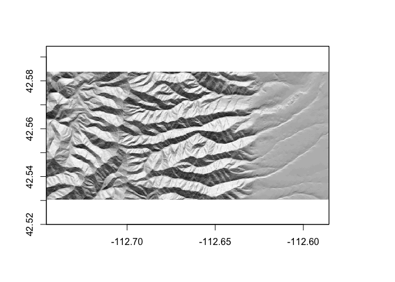

<!-- README.md is generated from README.Rmd. Please edit that file -->

# topoclimate.pred

<!-- badges: start -->
<!-- badges: end -->

This R package generates high-resolution estimates of biologically
effective microclimate for landscapes across North America, using tree
species distributions as climate indicators. It accompanies the paper
Kling, Baer, & Ackerly (currently in review).

## Installation

You can install the development version of topoclimate.pred like so:

``` r
devtools::install_github("matthewkling/topoclimte.pred")
```

## Usage

All users need in order to use the package is an elevation raster for a
landscape of interest in the US or Canada. In this example we’ll use the
`moonshine` dataset (representing elevation for a landscape near
Moonshine Peak in Idaho), which comes loaded with the package. Let’s
make a quick terrain map for this landscape:

``` r
library(topoclimate.pred)
hillshade <- hillShade(terrain(moonshine, "slope"), terrain(moonshine, "aspect"))
plot(hillshade, col = colorRampPalette(c("black", "white"))(50), legend = F)
```



To generate microclimate estimates, we simply pass our elevation raster
to the `topoclimate()` function. This function generates a set of
terrain and macroclimate variables for the landscape, and then uses them
in combination with the maximum likelihood estimates for the fitted
model (trained on North American tree species distributions) to estimate
topoclimate:

``` r
clim <- topoclimate(moonshine)
plot(clim, col = viridis::viridis_pal()(50), nrow = 1)
```


